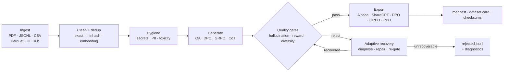

<p align="center">
  <a href="https://github.com/Lexsi-Labs/CuratorKIT">
    
  </a>
</p>

<p align="center">
  <b>Data curation and synthetic data generation for LLM post-training.</b><br>
  Ingest from any source, generate with any LLM, verify every sample against its origin,<br>
  recover what fails, and export trainer-ready datasets with full provenance.
</p>

<p align="center">
  <a href="https://pypi.org/project/curatorkit/"></a>
  <a href="https://www.python.org/"></a>
  <a href="https://github.com/Lexsi-Labs/CuratorKIT/blob/main/LICENSE"></a>
  <a href="https://lexsi-labs.github.io/CuratorKIT/"></a>
</p>

<p align="center">
  <a href="https://lexsi-labs.github.io/CuratorKIT/">Documentation</a> ·
  <a href="#quickstart">Quickstart</a> ·
  <a href="#tutorials">Tutorials</a> ·
  <a href="#ecosystem">Ecosystem</a> ·
  <a href="CONTRIBUTING.md">Contributing</a>
</p>

---

## Why CuratorKIT

Synthetic data is the fastest way to build a post-training dataset. It is also the fastest way to poison a model: generated samples hallucinate beyond their source material, drift off-distribution, duplicate each other, and quietly carry secrets, PII, and toxicity into training runs. Most teams find out after fine-tuning.

CuratorKIT treats dataset construction as a pipeline with quality gates, not a script with a prompt. Every generated answer is checked for grounding against the exact source chunk it came from. Rejected samples get diagnosed rather than discarded, and the fixable ones are repaired. Every run emits a provenance manifest, a dataset card, and checksums, so any sample can be audited back to its source.

## Key features

- **Grounded hallucination gate.** Verifies each generated answer against the source passage it was generated from, not against the judge model's general knowledge.
- **Reward and diversity gates.** Multi-dimension LLM-judge scoring plus embedding-based filtering against low-quality and near-duplicate samples.
- **Adaptive recovery.** An inline diagnostic probe classifies each rejection into a failure-mode taxonomy and repairs the recoverable ones.
- **Data hygiene.** Secrets detection, PII pseudonymization (Presidio), and toxicity filtering as pipeline stages.
- **Any source.** JSONL, JSON, CSV, Parquet, HuggingFace datasets, and PDFs with layout-aware parsing. Multi-source runs with per-source field mapping.
- **Eight generation tasks.** QA, preference pairs, GRPO rollouts, multi-turn, Evol-Instruct, chain-of-thought, and adversarial variants, on any LiteLLM-compatible API or local Ollama/vLLM.
- **Trainer-ready exports.** Alpaca, ShareGPT, DPO, GRPO, and PPO formats with train/val/test splits, consumed directly by TRL and [AlignTune](https://github.com/Lexsi-Labs/aligntune).
- **Provenance by default.** Every run writes `manifest.json`, `rejected.jsonl` with structured reasons, `dataset_card.md`, and SHA-256 `checksums.txt`.

## How it works



## Install

```bash
pip install "curatorkit[all]"        # connectors + generation + embedding + hygiene (recommended)
pip install curatorkit               # core only: cleaning and dedup
```

Requires Python 3.11+ on Linux, macOS, or Windows.

<details>
<summary>More install options</summary>

```bash
pip install "curatorkit[generation]"       # LLM generation only
pip install "curatorkit[generation-full]"  # generation + embedding + FAISS
pip install "curatorkit[connectors]"       # pyarrow + datasets (no LLM)
pip install "curatorkit[hygiene]"          # secrets / PII / toxicity gates
pip install "curatorkit[pdf]"              # layout-aware PDF parsing (MinerU)

# From source
pip install "curatorkit[all] @ git+https://github.com/Lexsi-Labs/CuratorKIT.git"
```

The [installation guide](https://lexsi-labs.github.io/CuratorKIT/getting-started/installation/) has the full extras table.

</details>

## Quickstart

**Clean and deduplicate an existing dataset (no LLM, no API key):**

```python
from curatorkit import Curator, CuratorConfig

result = Curator(CuratorConfig(
    dataset        = {"name": "tatsu-lab/alpaca", "max_samples": 2000},
    dedup          = "minhash",
    clean          = True,
    export_formats = ["alpaca", "sharegpt"],
    output_dir     = "output/clean",
)).run()

result.print_summary()
```

HF Hub sources need the `connectors` extra (included in `all`); local JSONL/CSV files run on the core install.

**Generate gated synthetic QA data from a document:**

```bash
export OPENAI_API_KEY=sk-...   # any LiteLLM backend works; local Ollama/vLLM too
```

```python
result = Curator(CuratorConfig(
    dataset                 = "handbook.pdf",          # needs the [pdf] extra
    llm_model               = "openai/gpt-4o-mini",
    generation_task         = "qa",
    num_questions           = 3,
    hallucination_threshold = 0.7,                     # grounding gate
    reward_threshold        = 0.7,                     # LLM-judge gate
    export_formats          = ["alpaca", "sharegpt"],
    output_dir              = "output/qa",
)).run()
```

**Or run a declarative YAML pipeline from the CLI:**

```bash
curatorkit run examples/quickstart/pipeline.yaml --output-dir output/
```

Every run writes `manifest.json`, `rejected.jsonl`, `dataset_card.md`, and `checksums.txt` alongside the export files. The [quickstart example](examples/quickstart/) runs end to end without an API key.

## What it generates

| `generation_task` | Output task type | Use for |
|-------------------|-----------------|---------|
| `qa` | `instruction_following` | SFT on question-answering |
| `preference` | `preference` | DPO training |
| `grpo` | `grpo` | GRPO training |
| `multiturn` | `conversational` | Multi-turn SFT |
| `evol` | `instruction_following` | Harder instruction variants |
| `cot` | `instruction_following` | Chain-of-thought reasoning |
| `adversarial_preference` | `preference` | Robustness DPO |
| `adversarial_qa` | `instruction_following` | Hallucination stress-test data |

## Output files

| File | Always written | Contents |
|------|:-------------:|---------|
| `manifest.json` | ✓ | Config hash, per-stage counts, rejection breakdown |
| `rejected.jsonl` | ✓ | All rejected samples with structured reason strings |
| `dataset_card.md` | ✓ | Human-readable run summary |
| `checksums.txt` | ✓ | SHA-256 for all output files |
| `sft_alpaca.jsonl` | optional | Alpaca-format SFT data |
| `sft_sharegpt.jsonl` | optional | ShareGPT conversation format |
| `dpo.jsonl` | optional | DPO preference pairs |
| `grpo.jsonl` | optional | GRPO group rollouts |
| `ppo.jsonl` | optional | PPO prompt-only format |
| `diagnostic_summary.json` | optional | Failure mode counts, recovery rate (when probe active) |

## Documentation

Full documentation lives at **[lexsi-labs.github.io/CuratorKIT](https://lexsi-labs.github.io/CuratorKIT/)**.

| Section | Contents |
|---------|----------|
| [Getting started](docs/getting-started/index.md) | Installation, quickstart, reading the output |
| [Guides](docs/guides/index.md) | Data sources, generation, quality gates, recovery, hygiene, exporters, customisation |
| [Configuration reference](docs/reference/configuration.md) | Every `CuratorConfig` parameter |
| [CLI & YAML](docs/reference/cli.md) | `curatorkit run`, all flags, the YAML pipeline schema |
| [API reference](https://lexsi-labs.github.io/CuratorKIT/reference/api/) | Generated from the source docstrings |
| [Architecture](docs/reference/architecture.md) | Base classes, contracts, provenance model |

## Tutorials

Eight runnable notebooks in [`notebooks/`](notebooks/) cover the feature set: generating SFT/DPO/GRPO datasets, multi-source ingestion, cleaning and dedup, adaptive recovery, adversarial generation, and the hygiene pipeline. Each opens in Colab. The [tutorials index](https://lexsi-labs.github.io/CuratorKIT/tutorials/) lists them with descriptions. Script versions of the same workflows live in [`examples/`](examples/).

## Contributing

The connector, generator, gate, and exporter layers are designed as plugin points. Read the [contributing guide](CONTRIBUTING.md) and the [architecture reference](docs/reference/architecture.md), then open an issue or PR. Questions go to [GitHub Discussions](https://github.com/Lexsi-Labs/CuratorKIT/discussions).

## Support

- **Documentation**: [lexsi-labs.github.io/CuratorKIT](https://lexsi-labs.github.io/CuratorKIT/)
- **GitHub Issues**: [github.com/Lexsi-Labs/CuratorKIT/issues](https://github.com/Lexsi-Labs/CuratorKIT/issues)
- **Discussions**: [github.com/Lexsi-Labs/CuratorKIT/discussions](https://github.com/Lexsi-Labs/CuratorKIT/discussions)
- **Email**: [pratinav.seth@lexsi.ai](mailto:pratinav.seth@lexsi.ai)

## Citation

If you use CuratorKIT in your research, please cite it (see [`CITATION.cff`](CITATION.cff)):

```bibtex
@software{curatorkit2026,
  author    = {Bhattacharjee, Soham and Sharma, Karun and Sankarapu, Vinay Kumar and Seth, Pratinav},
  title     = {CuratorKIT: Data Curation and Synthetic Data Generation for LLM Post-Training},
  year      = {2026},
  publisher = {Lexsi Labs},
  url       = {https://github.com/Lexsi-Labs/CuratorKIT}
}
```

## License

MIT; see [LICENSE](LICENSE). The optional `pdf` extra installs [MinerU](https://github.com/opendatalab/MinerU), which is licensed AGPL-3.0. Install it only if that suits your use.

---

## Contact

<div align="center">
  <a href="https://www.lexsi.ai">
    <picture>
      <source media="(prefers-color-scheme: dark)" srcset="docs/assets/lexsi-logo-white.png">
      
    </picture>
  </a>
  <p><a href="https://www.lexsi.ai">https://www.lexsi.ai</a></p>
  <p>Paris 🇫🇷 · Mumbai 🇮🇳 · London 🇬🇧</p>
</div>

## Ecosystem

CuratorKIT is part of the Lexsi Labs open-source stack:

- **[AlignTune](https://github.com/Lexsi-Labs/aligntune)** fine-tunes with the data you curate here. CuratorKIT's Alpaca, DPO, GRPO, and PPO exports are AlignTune's native input formats.
- **[TabTune](https://github.com/Lexsi-Labs/TabTune)** is a unified library for tabular foundation models.
- **[DLBacktrace](https://github.com/Lexsi-Labs/DLBacktrace)** and **[xai_evals](https://github.com/Lexsi-Labs/xai_evals)** cover model interpretability and explanation evaluation.
