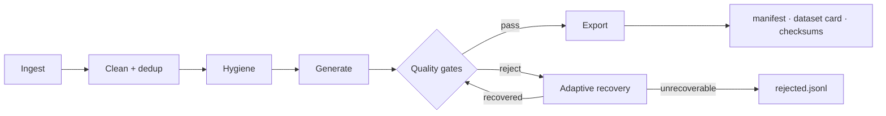

<div class="ck-hero" markdown>


<h1 class="ck-hero-title">Post-training data, <em>curated with proof</em>.</h1>

<p class="ck-tagline">
CuratorKIT builds LLM training datasets as a gated pipeline: ingest from any source,
generate with any LLM, verify every sample against its source, recover what fails,
and export trainer-ready formats, with a provenance manifest on every run.
</p>

[Get started](getting-started/index.md){ .md-button .md-button--primary }
[View on GitHub](https://github.com/Lexsi-Labs/CuratorKIT){ .md-button }

<p class="ck-chips">
<span>v1.0</span>
<span>MIT</span>
<span>Python 3.11+</span>
<span>core runs CPU-only</span>
<span>any LiteLLM backend</span>
</p>

</div>



<div class="grid cards" markdown>

-   :material-source-branch-check:{ .lg .middle } **Grounded hallucination gate**

    ---

    Each generated answer is verified against the exact source chunk it was
    generated from, not against the judge model's general knowledge.

-   :material-backup-restore:{ .lg .middle } **Adaptive recovery**

    ---

    Rejections are diagnosed against a failure-mode taxonomy; the recoverable
    ones are repaired and re-gated instead of discarded.

-   :material-shield-lock-outline:{ .lg .middle } **Data hygiene**

    ---

    Secrets detection, PII pseudonymisation, and toxicity filtering run as
    pipeline stages, before any sample reaches a training file.

-   :material-database-import:{ .lg .middle } **Any source**

    ---

    JSONL, JSON, CSV, Parquet, HuggingFace Hub, and layout-parsed PDFs.
    Multi-source runs support per-source field mapping.

-   :material-robot-outline:{ .lg .middle } **Eight generation tasks**

    ---

    QA, preference pairs, GRPO rollouts, multi-turn, Evol-Instruct,
    chain-of-thought, and adversarial variants, on any LiteLLM backend or
    local Ollama/vLLM.

-   :material-export:{ .lg .middle } **Trainer-ready exports**

    ---

    Alpaca, ShareGPT, DPO, GRPO, and PPO with train/val/test splits, consumed
    directly by TRL and [AlignTune](https://github.com/Lexsi-Labs/aligntune).

</div>

## Sixty seconds

=== "Python"

    ```python
    from curatorkit import Curator, CuratorConfig

    result = Curator(CuratorConfig(
        dataset        = {"name": "tatsu-lab/alpaca", "max_samples": 2000},
        dedup          = "minhash",
        clean          = True,
        export_formats = ["alpaca", "sharegpt"],
        output_dir     = "output/clean",
    )).run()

    result.print_summary()
    ```

    No LLM or API key needed for cleaning and dedup. Add `llm_model` and
    `generation_task` for gated synthetic generation; the
    [generation guide](guides/generation.md) covers it.

=== "CLI"

    ```bash
    pip install "curatorkit[all]"
    curatorkit run pipeline.yaml --output-dir output/
    ```

    Pipelines are declarative YAML, validated before anything runs. A runnable
    no-API-key example ships in
    [`examples/quickstart/`](https://github.com/Lexsi-Labs/CuratorKIT/tree/main/examples/quickstart);
    the schema is in the [CLI reference](reference/cli.md).

Every run writes `manifest.json`, `rejected.jsonl`, `dataset_card.md`, and
`checksums.txt` alongside the export files.

## Where next

<div class="ck-wide" markdown>

| | |
|---|---|
| **[Getting started](getting-started/index.md)** | Install, the three usage patterns, reading output |
| **[Guides](guides/index.md)** | Each pipeline stage in depth |
| **[Configuration](reference/configuration.md)** | Every `CuratorConfig` parameter |
| **[API reference](reference/api/index.md)** | Generated from the source docstrings |
| **[Tutorials](tutorials/index.md)** | Nine notebooks, each runnable in Colab |
| **[Roadmap](community/roadmap.md)** | Where 1.0 goes from here |

</div>

## Run the tutorials in Colab

<div class="ck-wide" markdown>

| | | |
|---|---|---|
| **01** Generate an SFT dataset from a PDF | [](https://colab.research.google.com/drive/1GqY-OoCz9WdyyUD6Qt9bCFI84bAFb52T?usp=sharing) | LLM endpoint |
| **02** Generate DPO preference pairs | [](https://colab.research.google.com/drive/1stGK2iPHUn_MM8xPtA9IlMifENSotXwH?usp=sharing) | LLM endpoint |
| **03** Generate GRPO rollouts | [](https://colab.research.google.com/drive/1U0XcubWNl7397PYx3cFpGxd7NIg2Kioz?usp=sharing) | LLM endpoint |
| **04** Ingest multiple sources | [](https://colab.research.google.com/drive/1SPG3mGHRVME1TrXM3Y1As6y_Tj3VjQSX?usp=sharing) | no LLM |
| **05** Clean and deduplicate a dataset | [](https://colab.research.google.com/drive/1JmF5MaE5cutvTB3LkwGlrr5nBc_c1dc3?usp=sharing) | no LLM |
| **06** Adaptive recovery | [](https://colab.research.google.com/drive/1OYGOUUWqH_HzgimTHq9R11eg6pyNjWs_?usp=sharing) | LLM endpoint |
| **07** Adversarial generation | [](https://colab.research.google.com/drive/1DSWNeHPI3elIL9Ts9U8s7DfFffTrPhoo?usp=sharing) | LLM endpoint |
| **08** Data hygiene pipeline | [](https://colab.research.google.com/drive/1HSXAKGSdXTPSw4CNN269Qj5N6ca0H89R?usp=sharing) | no LLM |
| **09** Filtered vs unfiltered fine-tuning | [](https://colab.research.google.com/drive/1sJ_LL-f4VbVGMol2F-Y3XppIvnU1JXUB?usp=sharing) | LLM endpoint + GPU |

</div>

New to the library? Start with **05**, then **04**, then the generation notebooks.
The [tutorials index](tutorials/index.md) has full descriptions.

---

## Cite

If you use CuratorKIT in your research, please cite the library and the relevant paper(s):

```bibtex
@software{curatorkit2026,
  author    = {Bhattacharjee, Soham and Sharma, Karun and Sankarapu, Vinay Kumar and Seth, Pratinav},
  title     = {CuratorKIT: Data Curation and Synthetic Data Generation for LLM Post-Training},
  year      = {2026},
  publisher = {Lexsi Labs},
  url       = {https://github.com/Lexsi-Labs/CuratorKIT}
}

@misc{bhattacharjee2026curatorkitdatacuration,
      title={CuratorKIT : Data Curation and Synthetic Data Generation for LLM Post-Training},
      author={Soham Bhattacharjee and Karun Sharma and Vinay Kumar Sankarapu and Pratinav Seth},
      year={2026},
      eprint={2606.21631},
      archivePrefix={arXiv},
      primaryClass={cs.CL},
      url={https://arxiv.org/abs/2606.21631},
}

@misc{bhattacharjee2026provenancegroundedgatingadaptiverecovery,
      title={Provenance-Grounded Gating and Adaptive Recovery in Synthetic Post-Training Data Curation},
      author={Soham Bhattacharjee and Karun Sharma and Vinay Kumar Sankarapu and Pratinav Seth},
      year={2026},
      eprint={2606.11127},
      archivePrefix={arXiv},
      primaryClass={cs.CL},
      url={https://arxiv.org/abs/2606.11127},
}
```

---

CuratorKIT is built by [Lexsi Labs](https://lexsi.ai) alongside
[AlignTune](https://github.com/Lexsi-Labs/aligntune), which consumes its exports
natively: curate here, train there.

<div class="ck-lexsi-footer" markdown>
<a href="https://www.lexsi.ai">
  
  
</a>
<p><a href="https://www.lexsi.ai">https://www.lexsi.ai</a></p>
<p>Paris 🇫🇷 · Mumbai 🇮🇳 · London 🇬🇧</p>
</div>
